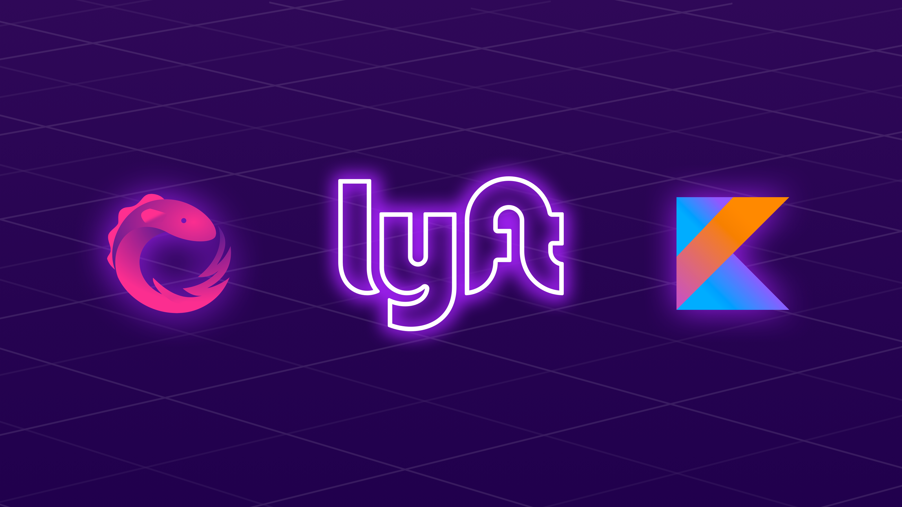

## What is this

This is a small set of RxJava and Kotlin puzzlers (code that looks simple but works not as you expect it to)

## What to do

- Clone the repo (to play with code!)
- Open project in IntelliJ IDEA
- Find puzzlers in [`puzzlers/src/test/kotlin/com/lyft/droidconnyc2017/puzzlers`](puzzlers/src/test/kotlin/com/lyft/droidconnyc2017/puzzlers) (they're formed as tests)
- Read comment above each puzzler describing what you need to figure out
- Solve as many puzzlers as you can!
- Share your results with link to this repo by mentioning [`@lyfteng`](https://twitter.com/lyfteng) or [`@artem_zin`](https://twitter.com/artem_zin) on Twitter 🎤
- You can solve puzzlers with whole team and use it as a little teambuilding event 😽
- Good luck and have fun!

## Explanations

We're going to publish explanations of why and how puzzlers work in our [Engineering Blog](https://eng.lyft.com/), you can follow it on [Medium](https://eng.lyft.com/) or [Twitter](https://twitter.com/lyfteng)

## Credits

Lots of thanks to [lyft/@buildbreaker](https://github.com/buildbreaker) and [lyft/@weefbellington](https://github.com/weefbellington) for feedback and contributions, as well as some of previous companies where [lyft/@artem-zinnatullin](https://github.com/artem-zinnatullin) worked before and faced some of these puzzlers in production: Juno, Yandex :heart:

## License 

Apache 2.0 (see [LICENSE](LICENSE))

This is mostly a Lyft project, but we've started the process too late and wasn't able to put it through OSS process to publish it under Lyft org, sorry about that!
